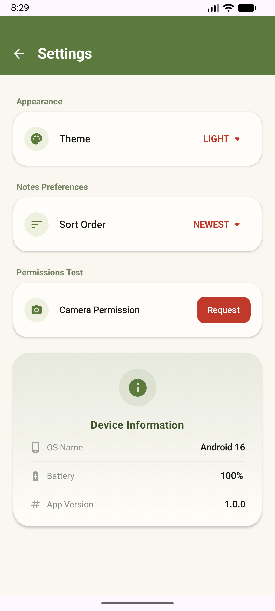
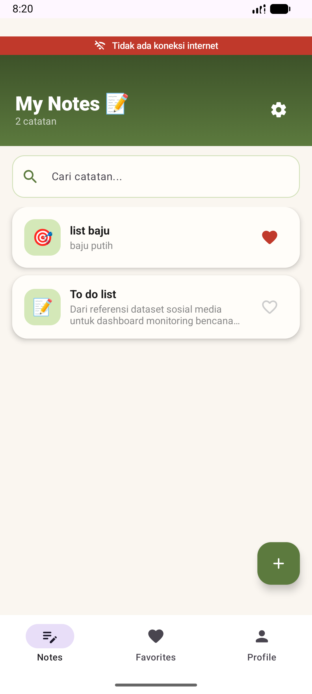

# Notes App — Integrasi Smart AI Chatbot (Gemini API)

**IF25-22017 Pengembangan Aplikasi Mobile**
Program Studi Teknik Informatika · Institut Teknologi Sumatera

### Identitas Mahasiswa
- **Nama**: Choirunnisa Syawaldina
- **NIM**: 123140136
- **Mata Kuliah**: Pengembangan Aplikasi Mobile RB

---

### Deskripsi Proyek
Proyek ini adalah pengembangan tingkat lanjut dari Notes App yang mengintegrasikan fitur **Smart Chatbot/Assistant** menggunakan **Google Gemini API** (`gemini-2.0-flash`). Aplikasi ini dibangun dengan KMP (Kotlin Multiplatform), mengimplementasikan arsitektur Clean Code, Dependency Injection (Koin), dan fitur-fitur spesifik platform (Network/Device Info).

Fitur Chatbot dirancang dengan tema visual **Matcha x Strawberry** yang ceria dan interaktif, memberikan pengalaman asisten virtual yang personal bagi pengguna.

---

### ✨ Fitur yang Diimplementasikan

#### 🤖 Smart AI Assistant (Gemini 2.0 Flash)
- [x] **Integrasi Gemini API**: Menggunakan Ktor Client untuk streaming content generation.
- [x] **Multi-turn Conversation (Bonus ⭐)**: Mempertahankan konteks obrolan (chat history) sehingga asisten dapat menjawab secara berkesinambungan.
- [x] **Streaming Response (Bonus ⭐)**: Efek teks yang muncul secara bertahap (real-time) memberikan kesan interaktif.
- [x] **Image Analysis (Bonus ⭐)**: Infrastruktur siap untuk menerima input gambar melalui Gemini Vision.
- [x] **Resilient Error Handling**: Implementasi *sealed class* `AIError` dan logika *retry with exponential backoff*.
- [x] **Matcha x Strawberry UI**: Desain chat bubble khusus dengan animasi *typing indicator* (3 dots animation).

#### 📱 Platform-Specific Features (Minggu 8)
- [x] **Koin Dependency Injection**: DI global untuk ViewModel, Repository, dan Service.
- [x] **Network & Device Monitor**: Deteksi status koneksi internet dan info perangkat secara native.
- [x] **Battery Info**: Menampilkan persentase dan status pengisian baterai.
- [x] **Runtime Permissions**: Pengelolaan izin kamera/lokasi secara native.

---

### 🏛️ Architecture Update (AI Integration)
```text
┌─────────────────────────────┐      ┌──────────────────────────┐
│       ChatViewModel         │◄─────┤      AIRepository        │
│ (StateFlow & UI Management) │      │ (Logic & History Mgmt)   │
└──────────────┬──────────────┘      └────────────┬─────────────┘
               │                                  │
               ▼                                  ▼
┌─────────────────────────────┐      ┌──────────────────────────┐
│         ChatScreen          │      │      GeminiService       │
│ (Matcha x Strawberry Theme) │      │ (Ktor API & SSE Stream)  │
└─────────────────────────────┘      └──────────────────────────┘
```

---

### 🛠️ Cara Konfigurasi API Key
Agar fitur AI dapat berjalan, Anda perlu menambahkan API Key Google Gemini ke dalam file `local.properties`:
```properties
GEMINI_API_KEY=YOUR_GEMINI_API_KEY
```
*Catatan: API Key dikelola melalui BuildConfig agar aman dan tidak ter-commit ke Git.*

---

## 🎥 Video Demonstrasi
Video demonstrasi memperlihatkan fitur Chatbot yang merespon secara streaming, kemampuan mengingat konteks chat, serta fitur native seperti network monitor dan info baterai.

🔗 **[Tonton Video Demo Fitur AI](https://drive.google.com/file/d/1G1DoNkzLYy77E11gd0Gx7RmAElmbaCdl/view?usp=sharing)**

---
##  Screenshots Layar

| AI Chatbot (Streaming) | Platform Info | Network Indicator |
|:---:|:---:|:---:|
|  |  |  |

*Dibuat dengan 🍵 & 🍓 · ITERA 2025*
