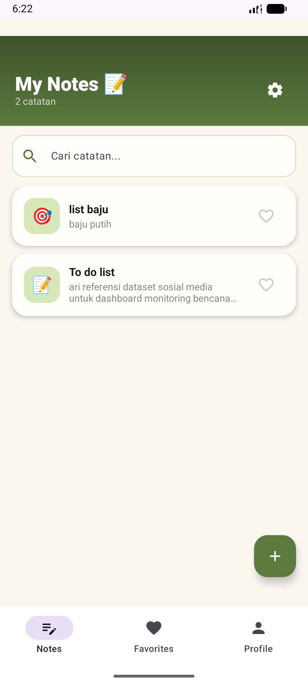
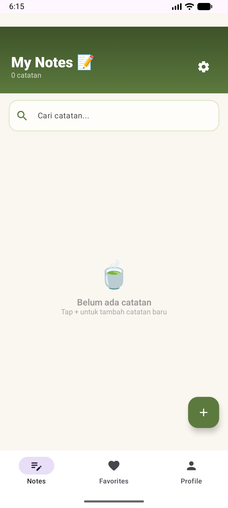
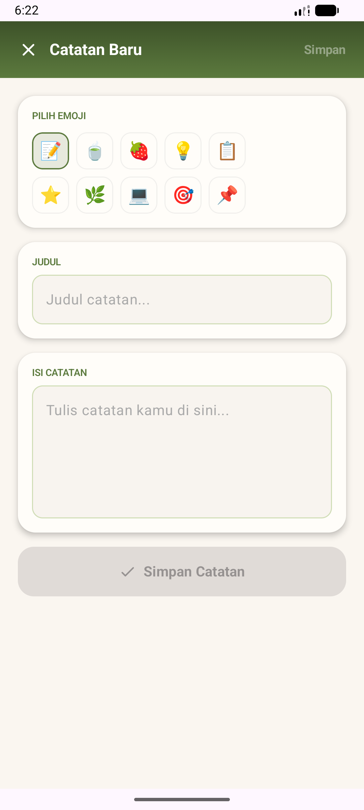
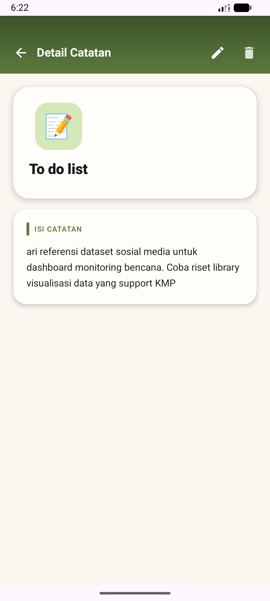
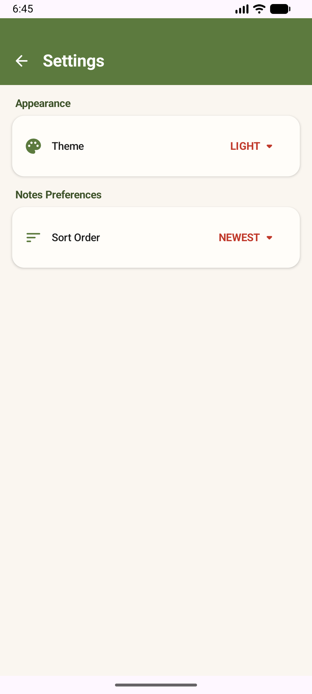

# Notes App - Offline First (KMP)

- **Nama:** Choirunnisa
- **NIM:** 123140136
- **Mata Kuliah:** Pengembangan Aplikasi Mobile RB

Aplikasi pencatatan (*Notes App*) berbasis **Kotlin Multiplatform (KMP)** yang dirancang dengan arsitektur *Offline-First*. Aplikasi ini memastikan data pengguna tetap aman dan dapat diakses kapan saja, tanpa bergantung pada koneksi internet, dengan mengusung antarmuka yang bersih, *minimalist*, dan *modern*.

Proyek ini dikembangkan untuk memenuhi **Tugas Minggu 7 - Pengembangan Aplikasi Mobile**.

## ✨ Fitur Utama

* **CRUD Operations:** Mendukung pembuatan (Create), pembacaan (Read), pembaruan (Update), dan penghapusan (Delete) catatan secara lokal[cite: 516].
* **Smart Search:** Fitur pencarian *real-time* untuk menemukan catatan spesifik berdasarkan judul atau isi.
* **User Preferences (DataStore):** Pengaturan personalisasi aplikasi seperti pilihan Tema (Light/Dark/System) dan urutan penyortiran catatan, disimpan dengan aman menggunakan `multiplatform-settings`.
* **Offline-First Architecture:** Mengandalkan **SQLDelight** sebagai *Single Source of Truth*, memastikan pengalaman pengguna yang mulus tanpa jeda *network*.
* **Reactive UI States:** Penanganan status layar yang responsif menggunakan `StateFlow` untuk transisi *Loading*, *Empty State* (saat belum ada catatan), dan *Content*.

---
##  Screenshots Layar

| Notes List | Empty State | Form Tambah |
|:---:|:---:|:---:|
|  |  |  |

| Detail Catatan | Settings Screen |
|:---:|:---:|:---:|
|  |  |

## 🎥 Video Demo (30 Detik)
Video demonstrasi yang menunjukkan semua alur navigasi dapat dilihat pada tautan berikut:
**[Tonton Video Demo di sini](https://drive.google.com/file/d/1UnAs8fvI0VvetaU7oNxArBhuxyv76ckN/view?usp=sharing)**

## 🗄️ Database Schema (SQLDelight)

Aplikasi ini menggunakan SQLDelight untuk menghasilkan API Kotlin yang *type-safe* dari *query* SQL. [cite_start]Berikut adalah skema tabel `Note` yang digunakan:

```sql
CREATE TABLE Note (
    id INTEGER PRIMARY KEY AUTOINCREMENT,
    title TEXT NOT NULL,
    content TEXT NOT NULL,
    created_at INTEGER NOT NULL,
    updated_at INTEGER NOT NULL
);

## 🎥 Video Demo (30 Detik)
Video demonstrasi yang menunjukkan semua alur navigasi dapat dilihat pada tautan berikut:
**[Tonton Video Demo di sini](https://drive.google.com/file/d/1UnAs8fvI0VvetaU7oNxArBhuxyv76ckN/view?usp=sharing)**
