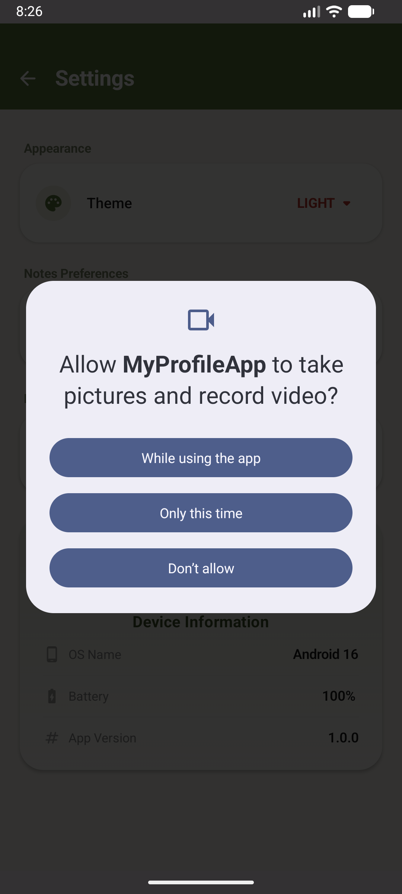

# Notes App — Tugas Minggu 8 (Platform-Specific Features)

**IF25-22017 Pengembangan Aplikasi Mobile**
Program Studi Teknik Informatika · Institut Teknologi Sumatera

### Identitas Mahasiswa
- **Nama**: Choirunnisa Syawaldina
- **NIM**: 123140136
- **Mata Kuliah**: Pengembangan Aplikasi Mobile RB

---

### Deskripsi Tugas
Proyek ini merupakan pembaruan (*upgrade*) dari Notes App (Tugas Minggu 7) dengan mengintegrasikan fitur-fitur spesifik platform (Android & iOS). Aplikasi KMP ini sekarang didukung penuh oleh **Koin Dependency Injection** dan memanfaatkan pola **expect/actual** untuk mengakses *Platform APIs* secara *native*.

### ✨ Fitur yang Diimplementasikan
Sesuai dengan instruksi tugas praktikum, seluruh fitur wajib dan bonus telah berhasil diintegrasikan:
- [x] **Koin Dependency Injection**: Injeksi dependensi (DI) menggunakan Koin secara global untuk `ViewModel`, `Repository`, dan Service pendukung.
- [x] **Network Monitor (expect/actual)**: Pemantauan status koneksi internet secara *real-time*.
- [x] **Device Info (expect/actual)**: Pengambilan informasi OS dan model perangkat spesifik platform.
- [x] **Network Status Indicator (UI)**: Indikator berupa *banner* berwarna merah yang muncul otomatis di *Main Screen* (layar utama) ketika koneksi internet terputus (Offline mode).
- [x] **Device Info Display (UI)**: Menampilkan informasi perangkat secara dinamis pada halaman *Settings Screen*.
- [x] **Runtime Permissions**: Pengelolaan dialog izin akses *native* platform (contoh: Izin Kamera/Lokasi) yang dapat dipicu dari halaman *Settings*.
- [x] **BONUS FEATURE: Battery Info (expect/actual)**: Menampilkan status level (persentase) dan *charging* baterai secara *native*.

---

### 🏛️ Architecture Diagram (Koin DI & KMP)
Berikut adalah diagram arsitektur yang mengilustrasikan pemisahan *layer* dan injeksi dependensi melalui modul Koin dalam ekosistem KMP:

```text
┌─────────────────────────────────────────────────────────────┐
│                       KOIN APP MODULE                       │
│                                                             │
│  [Single] DatabaseDriverFactory  [Single] DeviceInfo        │
│  [Single] NetworkMonitor         [Single] BatteryInfo       │
│  [Single] NoteRepository         [Single] SettingsManager   │
│                                                             │
│  [ViewModelOf] NotesViewModel    [ViewModelOf] SettingsVM   │
└─────────────────────────────┬───────────────────────────────┘
                              │ Inject via koinViewModel() & koinInject()
┌─────────────────────────────▼───────────────────────────────┐
│                       COMMON UI LAYER                       │
│                                                             │
│  ┌────────────────────┐   ┌──────────────────────────────┐  │
│  │ Main Screen        │   │ Settings Screen              │  │
│  │ - Notes List       │   │ - Theme & Sort Preferences   │  │
│  │ - NetworkIndicator │   │ - DeviceInfo & BatteryInfo   │  │
│  └────────────────────┘   │ - Permission Action Button   │  │
│                           └──────────────────────────────┘  │
└─────────────────────────────┬───────────────────────────────┘
                              │ calls / collects StateFlow
┌─────────────────────────────▼───────────────────────────────┐
│                    EXPECT/ACTUAL LAYER                      │
│                                                             │
│  [commonMain] expect classes (Network/Device/Battery)       │
│      ├── [androidMain] actual class (Android APIs)          │
│      └── [iosMain] actual class (iOS UIDevice APIs)         │
└─────────────────────────────────────────────────────────────┘
```
---
##  Screenshots Layar

| Network Status Indicator | Device & Battery Info | Permission Dialog |
|:---:|:---:|:---:|
|  |  |  |


## 🎥 Video Demonstrasi
Video demonstrasi di bawah ini memperlihatkan fungsionalitas utama: kelancaran aplikasi (bukti DI berjalan), pemantauan jaringan responsif dengan menyalakan Airplane Mode, serta tampilan Info Device, Baterai, dan Dialog Izin di halaman pengaturan.

🔗**[Tonton Video Demo di sini](https://drive.google.com/file/d/1G1DoNkzLYy77E11gd0Gx7RmAElmbaCdl/view?usp=sharing)**
