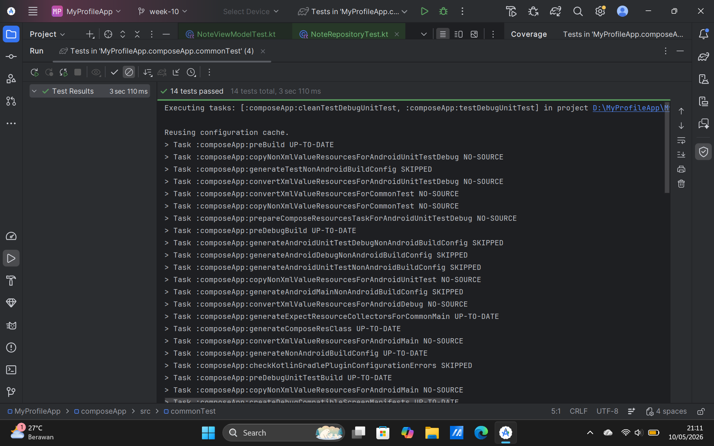

# Tugas Pertemuan 10: Testing & Dependency Injection

**Mata Kuliah:** Pengembangan Aplikasi Mobile  
**Program Studi:** Teknik Informatika - Institut Teknologi Sumatera

---

## Identitas Mahasiswa
- **Nama**: Choirunnisa Syawaldina
- **NIM**: 123140136
- **Kelas**: Pengembangan Aplikasi Mobile RB

---

## Deskripsi Proyek
Implementasi arsitektur **Clean Code**, **Koin Dependency Injection (DI)**, dan **Automated Testing** pada Notes App. Proyek ini mengedepankan kualitas kode dengan menerapkan pola AAA (Arrange, Act, Assert) pada pengujian secara menyeluruh untuk memastikan aplikasi berjalan stabil.

---

## ✅ Daftar Test Cases (Total: 14 Tests Passed)

### 1. NoteRepository (5 Test Cases)
- `[x]` Mengembalikan daftar catatan kosong pada inisialisasi awal.
- `[x]` Berhasil menyimpan catatan baru yang valid ke dalam database.
- `[x]` Memunculkan *exception* (gagal) ketika menyimpan catatan dengan judul kosong.
- `[x]` Berhasil menghapus catatan spesifik berdasarkan ID.
- `[x]` Berhasil mengambil data satu catatan spesifik berdasarkan ID.

### 2. NotesViewModel dengan MockK (4 Test Cases)
- `[x]` Memanggil fungsi `insertNote` di *repository* ketika `addNote` dieksekusi.
- `[x]` Memanggil fungsi `deleteNote` di *repository* ketika `deleteNote` dieksekusi.
- `[x]` Memastikan UI State memperbarui data secara reaktif setelah menambahkan catatan.
- `[x]` Memastikan UI State memperbarui data secara reaktif setelah menghapus catatan.

### 3. Flow Test dengan Turbine (2 Test Cases)
- `[x]` *State* awal memancarkan (emit) `Loading`, kemudian berubah menjadi `Success` saat data berhasil dimuat.
- `[x]` *State* berubah menjadi `Error` ketika *repository* mengembalikan kegagalan/exception.

### 4. UI Test Compose (3 Test Cases)
- `[x]` Menampilkan *Empty State Message* ("Belum ada catatan") saat daftar catatan masih kosong.
- `[x]` Menyimulasikan input teks pada *TextField* dan menekan tombol tambah dengan sukses.
- `[x]` Memastikan *item* catatan yang baru ditambahkan benar-benar *rendered* dan tampil di layar.

---

## 📊 Test Coverage Report 

---

## 🎬 Video Demo (45 Detik)
Video ini mendemonstrasikan proses eksekusi "Run All Tests" yang menunjukkan seluruh *test cases* berhasil (*Passed*) beserta hasil persentase *coverage*-nya.

**[Tonton Video Demo di Sini](https://drive.google.com/file/d/1efPznDmTDCBqY9zycDz4PoJLTybc7OSL/view?usp=sharing)**

---

### ✨ Fitur yang Diimplementasikan (Summary)
- **Smart AI Assistant**: Streaming response & multi-turn conversation dengan Gemini API.
- **Notes Management**: CRUD catatan dengan database lokal menggunakan SQLDelight.
- **Platform Specific**: Deteksi status baterai dan koneksi jaringan.
- **Clean Architecture**: Implementasi Dependency Injection dengan Koin.

*Dibuat dengan 🍵 & 🍓 · ITERA 2025*
