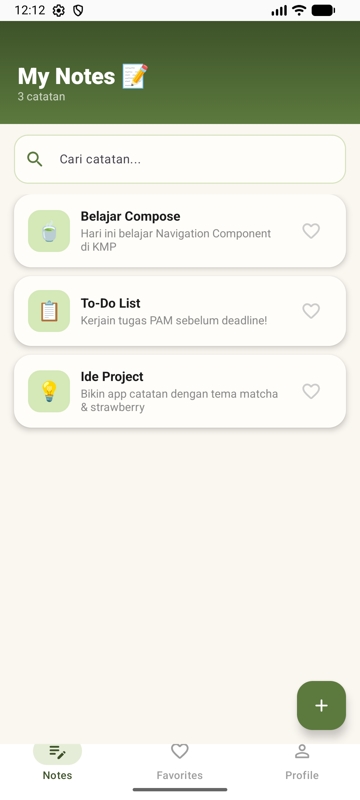
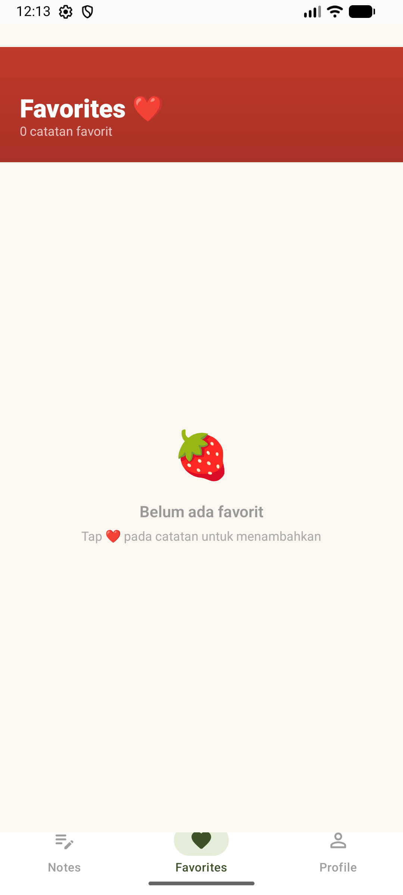
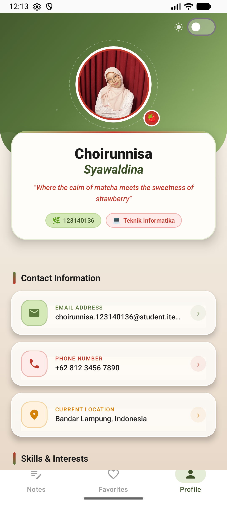
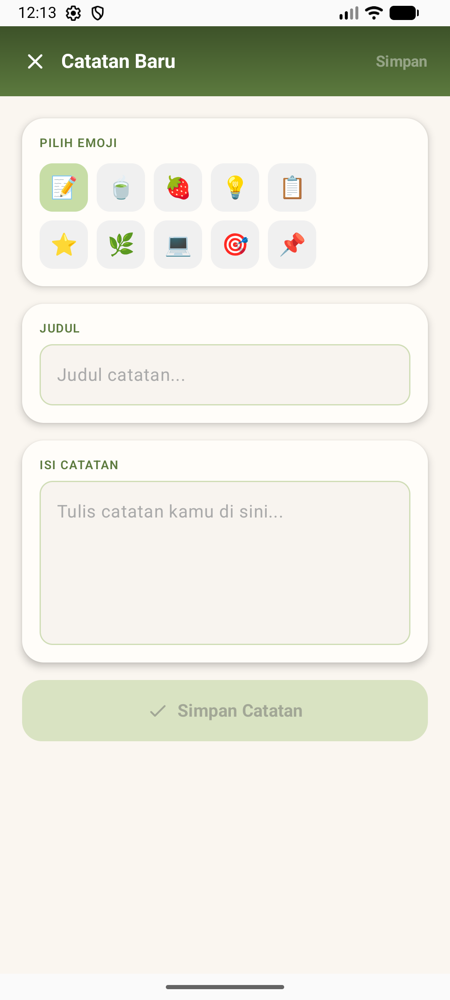
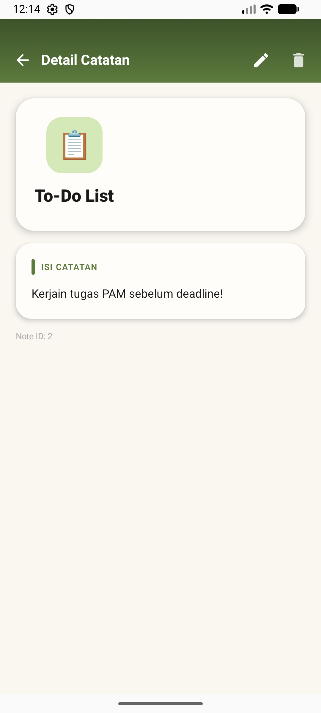
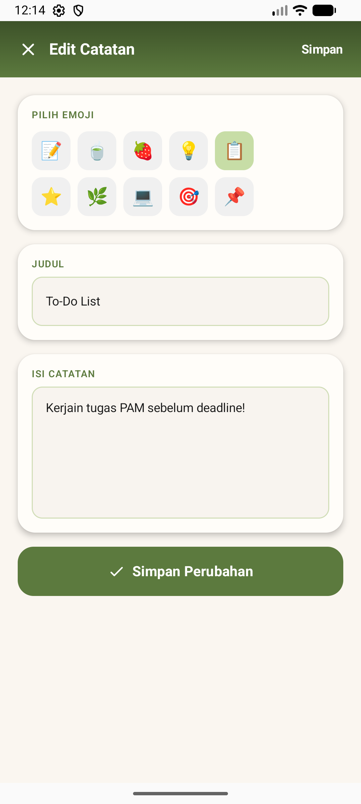

# Tugas Praktikum Minggu 5 - Navigasi Antar Layar

- **Nama:** Choirunnisa
- **NIM:** 123140136
- **Mata Kuliah:** Pengembangan Aplikasi Mobile RB

##  Deskripsi Tugas
Project ini merupakan pengembangan dari Notes App sebelumnya dengan penambahan fitur navigasi multi-screen menggunakan Compose Multiplatform sesuai dengan modul pertemuan 5.

##  Fitur yang Diimplementasikan
- [x] Bottom Navigation dengan 3 tabs (Notes, Favorites, Profile).
- [x] Navigasi Note List → Note Detail dengan mengirimkan `noteId`.
- [x] Floating Action Button (FAB) untuk navigasi ke halaman Add Note.
- [x] Back navigation yang berjalan baik dari semua layar.
- [x] Navigasi ke halaman Edit Note dengan mengirimkan `noteId` sebagai *argument*.
- [x] Struktur folder telah disesuaikan (`navigation/`, `screens/`, `components/`).

##  Screenshots Layar
*(Tambahkan screenshot untuk masing-masing layar di bawah ini)*

| Notes List | Favorites | Profile |
|:---:|:---:|:---:|
|  |  |  |

| Add Note | Note Detail | Edit Note |
|:---:|:---:|:---:|
|  |  |  |

## 🗺️ Navigation Flow Diagram

## 🎥 Video Demo (30 Detik)
Video demonstrasi yang menunjukkan semua alur navigasi dapat dilihat pada tautan berikut:
**[Tonton Video Demo di sini](https://drive.google.com/file/d/1UnAs8fvI0VvetaU7oNxArBhuxyv76ckN/view?usp=sharing)**
